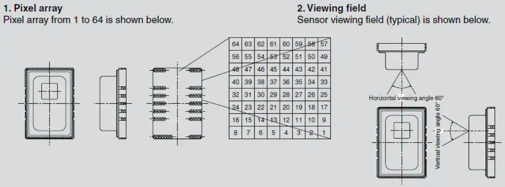

# Architecture
Infrastructure that collects data from sensors/Internet, processes it using Machine Learning and shows the output using video/sound/smell.

Our architecture is composed by 4 main parts:
1. **Sensors** (IoT element) : It is the input of our DynARTwork algorithm. We use an IoT device performing RIOT-OS to collect informations in the Museum using a  [Panasonic Grid Eye sensor](https://industrial.panasonic.com/ww/products/sensors/built-in-sensors/grid-eye).

1. **Cloud components**: We will use the Google Cloud Platform *(IoT Core, Firestore, Hosting, Pub/Sub, Cloud Vision API and Storage)* to collect and manipulate data.
2. **Artists' WebApp** (End-user components): This part will be used by the artists. It will have a simple UI/UX interface to hide all tech detail in order to permit artists to build their DyArtwork without worrying about technical details.
    We use Angular + [Material](https://material.angular.io/) + Firebase to create easily a [PWA](https://web.dev/progressive-web-apps/). It will be responsive and it will be immediately ready for Android / iOS and on the web.
3. **Actuators** (IoT elements): We will create an IoT device *(Raspberry PI 0)* which pull DynArtwork from the Cloud and it will redirect this stream to the HDMI output where the museum projector will be connected.

## Sensors:
ESP32 + I2C  + GRID EYE, CONNECTION WIRES, ETC... + DATASHEET + MAXIM ONE-WIRE

PORTS + CODE

## Actuators:
Raspberry Pi 0 W which is connected through mini-HDMI to Projector

#### Google IoT Core
Cloud IoT Core is a fully managed service that allows you to easily and securely connect, manage, and ingest data from millions of globally dispersed devices. Cloud IoT Core, in combination with other services on Cloud IoT platform, provides a complete solution for collecting, processing, analyzing, and visualizing IoT data in real time to support improved operational efficiency.
[Detail](https://cloud.google.com/iot-core).

#### Google Pub-Sub
Pub/Sub is an asynchronous messaging service that decouples services that produce events from services that process events.

- [Overview](https://cloud.google.com/pubsub/docs/overview)
- [Subscriber overview](https://cloud.google.com/pubsub/docs/subscriber)
A subscription can use either the pull or push mechanism for message delivery. You can change or configure the mechanism at any time.

**Pull subscription**: 
In pull delivery, your subscriber application initiates requests to the Pub/Sub server to retrieve messages.

1. The subscribing application explicitly calls the pull method, which requests messages for delivery.
2. The Pub/Sub server responds with the message (or an error if the queue is empty) , and an ack ID.
3. The subscriber explicitly calls the acknowledge method, using the returned ack ID to acknowledge receipt.

**Push subscription**:
In push delivery, Pub/Sub initiates requests to your subscriber application to deliver messages.

1. The Pub/Sub server sends each message as an HTTPS request to the subscriber application at a pre-configured endpoint.
2. The endpoint acknowledges the message by returning an HTTP success status code. A non-success response indicates that the message should be resent.

#### Google Cloud Vision

SafeSearch Detection detects explicit content such as adult content or violent content within an image. This feature uses five categories (adult, spoof, medical, violence, and racy) and returns the likelihood that each is present in a given image. See the SafeSearchAnnotation page for details on these fields.
[Tutorial](https://cloud.google.com/vision/docs/detecting-safe-search#vision_safe_search_detection-python).

#### Google Storage
The Buckets resource represents a bucket in Google Cloud Storage. There is a single global namespace shared by all buckets. 

Buckets contain objects which can be accessed by their own methods. In addition to the acl property, buckets contain bucketAccessControls, for use in fine-grained manipulation of an existing bucket's access controls.

A bucket is always owned by the project team owners group.
[Quickstart](https://cloud.google.com/storage/docs/quickstart-console)

#### ESP32
ESP32 is a series of low-cost, low-power system on a chip microcontrollers with integrated Wi-Fi and dual-mode Bluetooth. [Tech Description](https://duino4projects.com/esp32-wroom-32-esp-wroom-32/).

#### Grid Eye
Panasonic Grid-EYE® Infrared Array Sensors are surface mountable and feature 64 thermopile elements in an 8x8 grid format that detect absolute temperatures by infrared radiation. Grid-EYE is able to provide thermal images by measuring actual temperature and temperature gradients. Grid-EYE enables detection of multiple persons, identification of positions and direction of movement, almost independent of ambient light conditions without disturbing privacy as with conventional cameras. The built-in silicon lens provides a viewing angle of 60°. Measurement values are viewable through an I²C interface in 1 or 10 frames per second. The interrupt signal output delivers a quick response to time-critical events for a high degree of flexibility.
[Description](https://www.mouser.it/new/panasonic/panasonic-grid-eye-infrared-array-sensors/)

- Maxim package description: [link](http://www.farnell.com/datasheets/2286996.pdf)
- Official datasheet [link](https://cdn.sparkfun.com/assets/4/1/c/0/1/Grid-EYE_Datasheet.pdf)

- Tutorial: [link](https://www.14core.com/wiring-the-ir-thermal-amg88xx-grid-eye-thermopile-infrared-array-sensor-with-microcontroller/)

#### Raspberry Pi 0 W

Technical Specifications:

- 802.11 b/g/n wireless LAN
- Bluetooth 4.1
- Bluetooth Low Energy (BLE)
- 
- 1GHz, single-core CPU
- 512MB RAM
- Mini HDMI and USB On-The-Go ports
- Micro USB power
- HAT-compatible 40-pin header
- Composite video and reset headers
- CSI camera connector

Useful links:
- [Description](https://www.raspberrypi.org/products/raspberry-pi-zero-w/)
- [Install Raspbian](https://www.raspberrypi.org/documentation/installation/installing-images/)
- [Piwheels](https://www.piwheels.org/)

