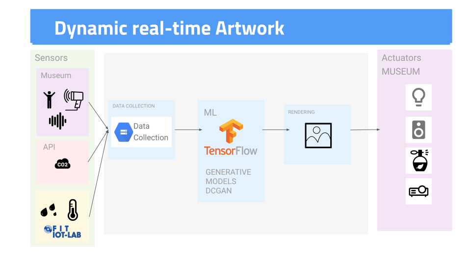

# Architecture
Infrastructure that collects data from sensors/Internet, processes it using Machine Learning and shows the output using video/sound/smell.

## Sensors:
- Thermal camera, temperature, humidity,....
- External data (API), internally but in another places(ex. Rome)
- Simulated data/IoT-Lab

## Actuators:
- Projector/monitor
- Sound
- Smell: [Product](http://www.emhealia.com/em-station/) [History](https://www.linkedin.com/pulse/da-zero-prodotto-francesco-colasante/) 
- Video-Mapping?

## Technology:
IoT sensors
External API
Cloud Machine Learning

