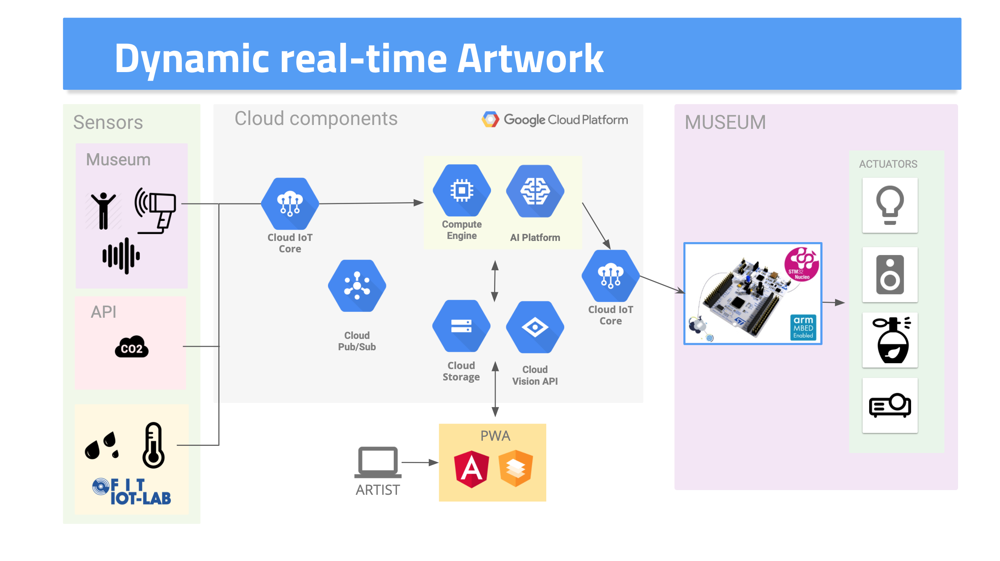
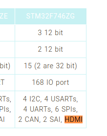

# Architecture
Infrastructure that collects data from sensors/Internet, processes it using Machine Learning and shows the output using video/sound/smell.

Our architecture is composed by 4 main parts:
1. **Sensors** (IoT elements) : It is the input of our DynARTwork algorithm. We will use IoT-devices performing RIOT-OS to collect informations in the Museum.
2. **Cloud components**: We will use the Google Cloud Platform *(IoT Core, ML kit, Firestore, Hosting, Pub/Sub)* to collect and manipulate data.
3. **Artists' WebApp** (End-user components): This part will be used by the artists. It will have a simple UI/UX interface to hide all tech detail in orderto permit artists to build their DyArtwork without worrying about technical details.
We will use Angular + [Material](https://material.angular.io/) + Firebase to create easily a [PWA](https://web.dev/progressive-web-apps/). It will be responsive and it will be immediately ready for Android / iOS and on the web.

4. **Actuators** (IoT elemets): We will create an IoT device *(ST Nucleo board)* which pull DynArtwork from the Cloud (ex. [RTMP](https://en.wikipedia.org/wiki/Real-Time_Messaging_Protocol) /[RSTP](https://en.wikipedia.org/wiki/Real_Time_Streaming_Protocol)/[NDI](https://en.wikipedia.org/wiki/Network_Device_Interface)) and it will redirect this stream to the HDMI output where the museum projector will be connected.

## Sensors:
- Thermal camera, temperature, humidity,....
- External data (example: [Air Quality Programmatic APIs](https://aqicn.org/api/))
- Simulated data/IoT-Lab

## Actuators:
- Projector/monitor: HDMI
- Sound: Jack
- Smell: API [Product](http://www.emhealia.com/em-station/) [History](https://www.linkedin.com/pulse/da-zero-prodotto-francesco-colasante/) 
- Video-Mapping: [NDI](https://en.wikipedia.org/wiki/Network_Device_Interface)

We evaluated the possibility of connecting HDMI directly to our [ST Nucleo Board](https://www.st.com/en/microcontrollers-microprocessors/stm32mp157c.html).

- [How to display on HDMI](https://wiki.st.com/stm32mpu/wiki/How_to_display_on_HDMI)
- [Nucleo datasheet](https://www.st.com/resource/en/data_brief/nucleo-f746zg.pdf)

- [DSI to HDMI adapter](https://www.st.com/en/development-tools/b-lcdad-hdmi1.html). *if the card does not have an integrated connector*-

## Technology:
- IoT sensors: eg. Grid-Eye.
- External API: IoT Core, Cloud Storage, Cloud Vision, AI Platform.
- Cloud Machine Learning: [arbitrary_image_stylization](https://github.com/tensorflow/magenta/tree/master/magenta/models/arbitrary_image_stylization).

